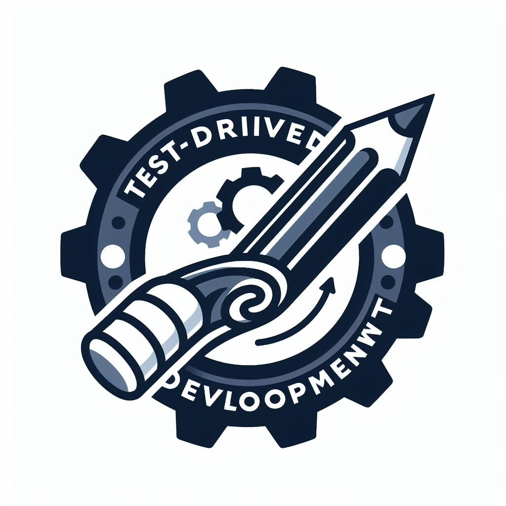

<div align="center">


  <br/>

<h3><b>TDD Project</b></h3>

</div>

<!-- TABLE OF CONTENTS -->

# 📗 Table of Contents

- [📗 Table of Contents](#-table-of-contents)
- [📖 TDD Project ](#-tdd-project-)
  - [🛠 Built With ](#-built-with-)
    - [Tech Stack ](#tech-stack-)
    - [Key Features ](#key-features-)
  - [💻 Getting Started ](#-getting-started-)
    - [Prerequisites](#prerequisites)
    - [Setup](#setup)
    - [Install](#install)
    - [Usage](#usage)
    - [Run tests](#run-tests)
  - [👥 Authors ](#-authors-)
  - [🔭 Future Features ](#-future-features-)
  - [🤝 Contributing ](#-contributing-)
  - [⭐️ Show your support ](#️-show-your-support-)
  - [🙏 Acknowledgments ](#-acknowledgments-)
  - [📝 License ](#-license-)

<!-- PROJECT DESCRIPTION -->

# 📖 TDD Project <a name="about-project"></a>

**TDD Project** project will implement a class with some methods, but will do it by doing test-driven development (TDD).  

## 🛠 Built With <a name="built-with"></a>

### Tech Stack <a name="tech-stack"></a>

- Ruby

<!-- Features -->

### Key Features <a name="key-features"></a>

- Factorial Method
- Reverse Method
- FizzBuzz Method

<p align="right">(<a href="#readme-top">back to top</a>)</p>

<!-- GETTING STARTED -->

## 💻 Getting Started <a name="getting-started"></a>

To get a local copy up and running, follow these steps.

### Prerequisites

In order to run this project you need:

-VScode 
-Installed Ruby

### Setup

Clone this repository to your desired folder:

```sh
  git clone git@github.com:George7h/TDD-project.git
```

### Install

Install this project with:

```sh
  bundle install
```

### Usage

To run the project, execute the following command in your terminal:

```sh
ruby main.rb
```

### Run tests

To run tests, run the following command:

```sh
  rspec ./spec
```
--->
<p align="right">(<a href="#readme-top">back to top</a>)</p>

<!-- AUTHORS -->

## 👥 Authors <a name="author"></a>

👤 **George Hamman**

- GitHub: [@githubhandle](https://github.com/George7h)
- LinkedIn: <a href="https://www.linkedin.com/in/george-hamman-95b98224b/">George Hamman</a>

👤 **Karan Joshi**

- GitHub: [@githubhandle](https://github.com/DevKaranJ)
- Twitter: [@twitterhandle](https://twitter.com/DevKaranJ)
- Linkdin: [@linkdinhandle](https://www.linkedin.com/in/devkaranj/)

<p align="right">(<a href="#readme-top">back to top</a>)</p>

<!-- FUTURE FEATURES -->

## 🔭 Future Features <a name="future-features"></a>

- **Comming soon**


<p align="right">(<a href="#readme-top">back to top</a>)</p>

<!-- CONTRIBUTING -->

## 🤝 Contributing <a name="contributing"></a>

Contributions, issues, and feature requests are welcome!

Feel free to check the [issues page](https://github.com/george7h/TDD-project/issues).

<p align="right">(<a href="#readme-top">back to top</a>)</p>

<!-- SUPPORT -->

## ⭐️ Show your support <a name="support"></a>

If you like this project you can share this project to your friend

<p align="right">(<a href="#readme-top">back to top</a>)</p>

<!-- ACKNOWLEDGEMENTS -->

## 🙏 Acknowledgments <a name="acknowledgements"></a>

I would like to thank microverse for this project

<p align="right">(<a href="#readme-top">back to top</a>)</p>

<!-- LICENSE -->

## 📝 License <a name="license"></a>

This project is licensed under the [MIT License](./LICENSE).

<p align="right">(<a href="#readme-top">back to top</a>)</p>
